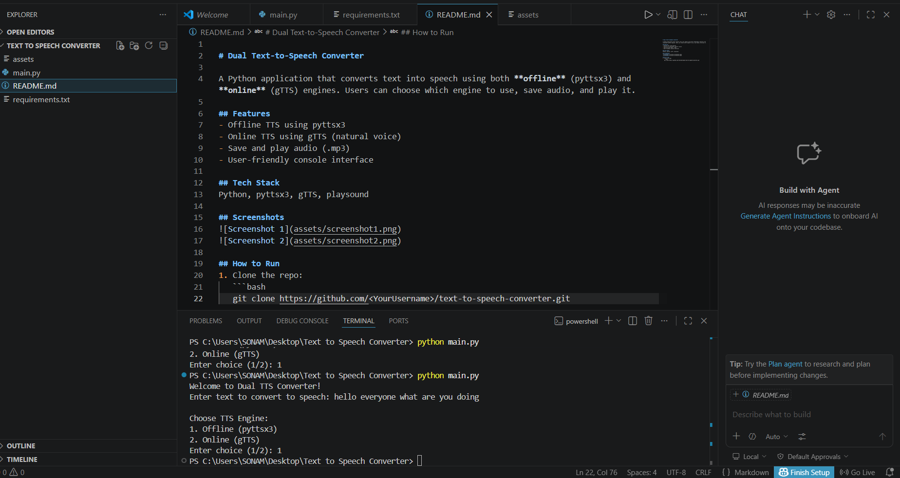

<<<<<<< HEAD

=======
>>>>>>> 3b1148e216fe8eebfb84d31cb684bb6ef00110a5
# Dual Text-to-Speech Converter

A Python application that converts text into speech using both **offline** (pyttsx3) and **online** (gTTS) engines. Users can choose which engine to use, save audio, and play it.

## Features
- Offline TTS using pyttsx3
- Online TTS using gTTS (natural voice)
- Save and play audio (.mp3)
- User-friendly console interface

## Tech Stack
Python, pyttsx3, gTTS, playsound

## Screenshots


## How to Run
1. Clone the repo:
   ```bash
<<<<<<< HEAD
   git clone https://github.com/sonamkardam29/Text-To-speech-converter.git
=======
   git clone https://github.com/sonamkardam29/Text-To-speech-converter.git
   
>>>>>>> 3b1148e216fe8eebfb84d31cb684bb6ef00110a5
